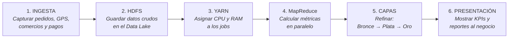
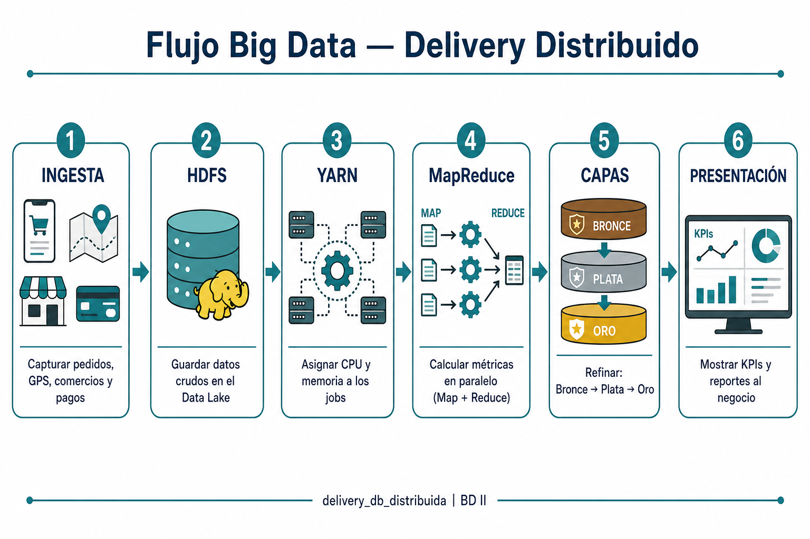

# Arquitectura Big Data — Delivery Distribuido

Proyecto: `delivery_db_distribuida` | Curso: Base de Datos II

Documento de apoyo a la infografía: explica cada punto del flujo y qué se hace en cada etapa.

---

## Gráfico del flujo (qué se hace en cada punto)

> Archivos: `flujo_big_data_puntos.png` · `arquitectura_big_data_delivery.png`

---

## 1. Ingesta

**Qué es:** entrada de datos del negocio delivery.

**Fuentes:**
- App móvil — pedidos y clientes
- Comercios — menú, productos, estados
- GPS repartidores — ubicación y tracking
- Pagos — transacciones y bitácora

**Qué se hace aquí:** capturar los flujos de pedidos, tracking y pagos antes de almacenarlos a gran escala.

---

## 2. Almacenamiento — HDFS

**Qué es:** Data Lake sobre HDFS (sistema de archivos distribuido de Hadoop).

**Qué se guarda:**
- datos crudos en CSV / JSON / Parquet
- logs de pedidos
- telemetría GPS

**Qué se hace aquí:** acumular el volumen masivo de forma distribuida. En esta etapa aún no se analiza el dato; solo se almacena.

---

## 3. Gestión de recursos — YARN

**Qué es:** el planificador de recursos del clúster Hadoop.

**Qué se hace aquí:** asignar CPU y RAM a los jobs de procesamiento (MapReduce u otros). Sin YARN, el clúster no coordinaría en qué nodos ni con cuántos recursos corre cada trabajo.

---

## 4. Procesamiento — MapReduce

**Qué es:** motor de cómputo en paralelo (Map + Reduce).

**Cómo funciona:**
- **Map** — parte los datos (por región o por pedido)
- **Shuffle / Sort** — reordena y agrupa claves intermedias
- **Reduce** — calcula agregaciones finales

**Ejemplos aplicados al delivery:**
- conteo de pedidos por región (LIM-N, LIM-S, AQP)
- tiempo de entrega promedio
- ventas por comercio

**Qué se hace aquí:** transformar datos crudos en métricas útiles de negocio.

---

## 5. Capas de datos

**Qué es:** maduración del dato (modelo tipo medalla / medallion).

| Capa | Nombre | Contenido | Qué se hace |
|------|--------|-----------|-------------|
| **RAW / Bronce** | Crudos | Dato tal cual llega | Recepcionar sin transformar |
| **TRUSTED / Plata** | Confiables | Dato limpio | Limpiar y particionar por región |
| **SERVING / Oro** | Listos para negocio | KPIs y agregados | Publicar indicadores listos para consulta |

**Qué se hace aquí:** pasar de “dato sucio” a “indicador usable” (Bronce → Plata → Oro).

---

## 6. Presentación de resultados

**Qué es:** capa de consumo para gerencia y operaciones.

**Salidas:**
- Tablero gerencial (dashboards)
- Reportes SQL / NoSQL (consultas del proyecto en PostgreSQL y MongoDB)
- KPIs: ventas, ETA, repartidores, desempeño por región

**Qué se hace aquí:** mostrar los resultados procesados para apoyo a la decisión.

---

## Resumen en una línea

| # | Punto | En una frase |
|---|--------|--------------|
| 1 | Ingesta | Capturar pedidos, GPS, comercios y pagos |
| 2 | HDFS | Guardar datos crudos en el Data Lake |
| 3 | YARN | Asignar CPU y memoria a los jobs |
| 4 | MapReduce | Calcular métricas en paralelo |
| 5 | Capas | Refinar: Bronce → Plata → Oro |
| 6 | Presentación | Mostrar KPIs y reportes al negocio |

**Flujo completo:** fuentes → HDFS → YARN asigna recursos → MapReduce calcula → capas refinan → resultados al negocio.
