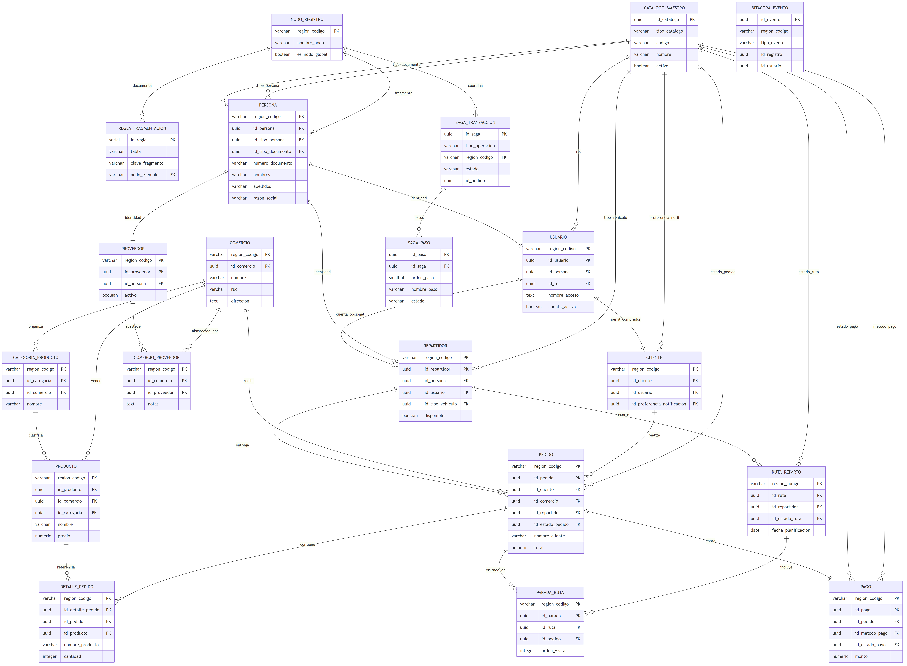
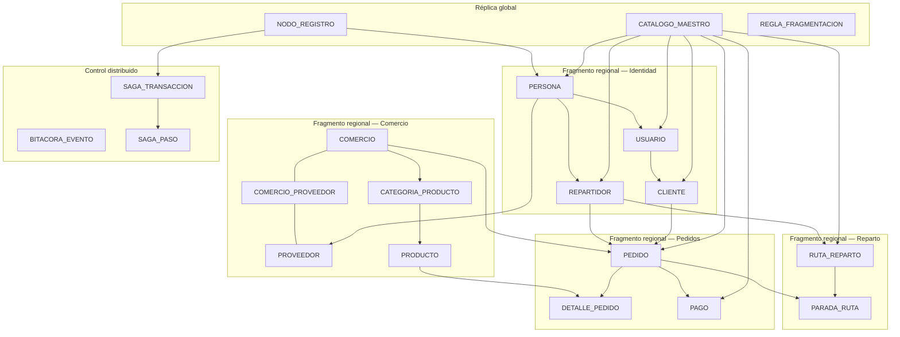

# Modelo Entidad-Relación (MER) — delivery_db_distribuida

Base de datos para plataforma de **delivery** adaptada a un entorno **distribuido** (fragmentación horizontal por `region_codigo`).  
Script fuente: `delivery_db_distribuida.sql`

---

## Diagrama MER



*Imagen generada desde `delivery_db_distribuida_mer.mmd`. Fuente editable en Mermaid: [Mermaid Live Editor](https://mermaid.live).*



---

## Convenciones del modelo distribuido

| Convención | Descripción |
|------------|-------------|
| **PK compuesta** | Tablas regionales usan `(region_codigo, id_*)` para forzar co-ubicación en el mismo nodo. |
| **UUID** | Identificadores globales únicos entre nodos. |
| **Catálogo centralizado** | Valores fijos en `catalogo_maestro`; las tablas referencian `id_catalogo`. |
| **Desnormalización** | `pedido` y `detalle_pedido` guardan nombres copiados al crear el pedido. |
| **Referencias lógicas** | `bitacora_evento` y `saga_transaccion.id_pedido` no tienen FK física entre fragmentos. |

**Nodos de ejemplo:** `GLOBAL`, `LIM-N`, `LIM-S`, `AQP`.

---

## 1. Entidades globales y metadatos

### NODO_REGISTRO

Catálogo de regiones/nodos del sistema distribuido.

| Atributo | Tipo | Clave |
|----------|------|-------|
| region_codigo | VARCHAR(10) | **PK** |
| nombre_nodo | VARCHAR(80) | |
| host | VARCHAR(120) | |
| puerto | INTEGER | |
| activo | BOOLEAN | |
| es_nodo_global | BOOLEAN | |
| fecha_alta | TIMESTAMPTZ | |

---

### CATALOGO_MAESTRO

Réplica global de todos los valores de catálogo. Se discrimina por `tipo_catalogo`.

| Atributo | Tipo | Clave |
|----------|------|-------|
| id_catalogo | UUID | **PK** |
| tipo_catalogo | VARCHAR(40) | UK (con codigo) |
| codigo | VARCHAR(40) | UK (con tipo_catalogo) |
| nombre | VARCHAR(120) | |
| descripcion | TEXT | |
| orden_presentacion | SMALLINT | |
| activo | BOOLEAN | |

**Tipos registrados:**

| tipo_catalogo | Ejemplos de codigo |
|---------------|-------------------|
| TIPO_PERSONA | NATURAL, JURIDICA |
| TIPO_DOCUMENTO | DNI, RUC |
| ROL | CLIENTE, REPARTIDOR, ADMINISTRADOR |
| PREFERENCIA_NOTIFICACION | TODAS, SOLO_PEDIDOS, NINGUNA |
| TIPO_VEHICULO | BICI, MOTO, AUTO, OTRO |
| ESTADO_PEDIDO | CREADO, CONFIRMADO, EN_CAMINO, ENTREGADO, CANCELADO |
| METODO_PAGO | EFECTIVO, TARJETA, YAPE, PLIN, TRANSFERENCIA |
| ESTADO_PAGO | PENDIENTE, PAGADO, RECHAZADO, DEVUELTO |
| ESTADO_RUTA | PLANIFICADA, EN_PROGRESO, FINALIZADA, CANCELADA |

---

### REGLA_FRAGMENTACION

Documentación en BD de cómo se fragmenta cada tabla.

| Atributo | Tipo | Clave |
|----------|------|-------|
| id_regla | SERIAL | **PK** |
| tabla | VARCHAR(64) | |
| clave_fragmento | VARCHAR(40) | |
| criterio | TEXT | |
| nodo_ejemplo | VARCHAR(10) | **FK → NODO_REGISTRO** |

**Relación:** `REGLA_FRAGMENTACION` **N:1** `NODO_REGISTRO` (cada regla apunta a un nodo de ejemplo).

---

## 2. Identidad y acceso (fragmento regional)

### PERSONA

Identidad base de cualquier actor (cliente, repartidor, proveedor).

| Atributo | Tipo | Clave |
|----------|------|-------|
| region_codigo | VARCHAR(10) | **PK**, **FK → NODO_REGISTRO** |
| id_persona | UUID | **PK** |
| id_tipo_persona | UUID | **FK → CATALOGO_MAESTRO** |
| id_tipo_documento | UUID | **FK → CATALOGO_MAESTRO** |
| numero_documento | VARCHAR(20) | UK (con region + tipo doc) |
| nombres, apellidos | VARCHAR(120) | Obligatorios si NATURAL |
| razon_social | VARCHAR(200) | Obligatorio si JURIDICA |
| correo, telefono, direccion | | |
| activo | BOOLEAN | |

---

### USUARIO

Cuenta de acceso vinculada a una persona.

| Atributo | Tipo | Clave |
|----------|------|-------|
| region_codigo, id_usuario | | **PK** |
| id_persona | UUID | **FK → PERSONA**, UK (con region) |
| id_rol | UUID | **FK → CATALOGO_MAESTRO** (tipo ROL) |
| nombre_acceso | TEXT | UK (por region) |
| contrasena_hash | TEXT | |
| cuenta_activa | BOOLEAN | |

---

### CLIENTE

Perfil del comprador (extiende usuario).

| Atributo | Tipo | Clave |
|----------|------|-------|
| region_codigo, id_cliente | | **PK** |
| id_usuario | UUID | **FK → USUARIO**, UK (con region) |
| id_preferencia_notificacion | UUID | **FK → CATALOGO_MAESTRO** |
| acepta_publicidad | BOOLEAN | |
| idioma_preferido | VARCHAR(10) | |
| moneda_preferida | VARCHAR(3) | |

---

### REPARTIDOR

Conductor que entrega pedidos.

| Atributo | Tipo | Clave |
|----------|------|-------|
| region_codigo, id_repartidor | | **PK** |
| id_persona | UUID | **FK → PERSONA**, UK (con region) |
| id_usuario | UUID | **FK → USUARIO**, UK (con region), opcional |
| id_tipo_vehiculo | UUID | **FK → CATALOGO_MAESTRO** |
| placa | VARCHAR(15) | |
| disponible | BOOLEAN | |

---

## 3. Comercio y catálogo de productos

### COMERCIO

Establecimiento que vende por delivery.

| Atributo | Tipo | Clave |
|----------|------|-------|
| region_codigo, id_comercio | | **PK** |
| nombre | VARCHAR(160) | |
| ruc | VARCHAR(20) | UK (con region) |
| direccion | TEXT | |
| activo | BOOLEAN | |

---

### PROVEEDOR

Rol de abastecimiento; identidad en `persona`.

| Atributo | Tipo | Clave |
|----------|------|-------|
| region_codigo, id_proveedor | | **PK** |
| id_persona | UUID | **FK → PERSONA**, UK (con region) |
| activo | BOOLEAN | |
| notas | TEXT | |

---

### COMERCIO_PROVEEDOR

Tabla puente **muchos a muchos** entre comercio y proveedor.

| Atributo | Tipo | Clave |
|----------|------|-------|
| region_codigo, id_comercio, id_proveedor | | **PK** |
| notas | TEXT | |
| fecha_alta | TIMESTAMPTZ | |

---

### CATEGORIA_PRODUCTO / PRODUCTO

Organización del menú de cada comercio.

| Entidad | Relación principal |
|---------|-------------------|
| CATEGORIA_PRODUCTO | **N:1** COMERCIO |
| PRODUCTO | **N:1** COMERCIO, **N:1** CATEGORIA_PRODUCTO (opcional) |

---

## 4. Pedidos y pagos

### PEDIDO

Orden de compra del cliente a un comercio.

| Atributo | Tipo | Clave |
|----------|------|-------|
| region_codigo, id_pedido | | **PK** |
| id_cliente | UUID | **FK → CLIENTE** |
| id_comercio | UUID | **FK → COMERCIO** |
| id_repartidor | UUID | **FK → REPARTIDOR**, opcional |
| id_estado_pedido | UUID | **FK → CATALOGO_MAESTRO** |
| nombre_cliente, nombre_comercio | VARCHAR | Desnormalizados |
| direccion_entrega | TEXT | |
| subtotal, costo_envio, total | NUMERIC | |

---

### DETALLE_PEDIDO

Líneas del pedido (productos y cantidades).

| Atributo | Tipo | Clave |
|----------|------|-------|
| region_codigo, id_detalle_pedido | | **PK** |
| id_pedido | UUID | **FK → PEDIDO** |
| id_producto | UUID | **FK → PRODUCTO** |
| nombre_producto | VARCHAR(160) | Snapshot |
| cantidad, precio_unitario, importe_linea | | |

**Cardinalidad:** un pedido tiene **1..N** detalles; cada detalle referencia **1** producto.

---

### PAGO

Un pago por pedido (relación **1:1**).

| Atributo | Tipo | Clave |
|----------|------|-------|
| region_codigo, id_pago | | **PK** |
| id_pedido | UUID | **FK → PEDIDO**, UK (con region) |
| id_metodo_pago | UUID | **FK → CATALOGO_MAESTRO** |
| id_estado_pago | UUID | **FK → CATALOGO_MAESTRO** |
| monto | NUMERIC | |

---

## 5. Rutas de reparto

### RUTA_REPARTO

Plan de recorrido de un repartidor en un día.

| Atributo | Tipo | Clave |
|----------|------|-------|
| region_codigo, id_ruta | | **PK** |
| id_repartidor | UUID | **FK → REPARTIDOR** |
| id_estado_ruta | UUID | **FK → CATALOGO_MAESTRO** |
| fecha_planificacion | DATE | |

---

### PARADA_RUTA

Cada parada vincula una ruta con un pedido y un orden de visita.

| Atributo | Tipo | Clave |
|----------|------|-------|
| region_codigo, id_parada | | **PK** |
| id_ruta | UUID | **FK → RUTA_REPARTO** |
| id_pedido | UUID | **FK → PEDIDO** |
| orden_visita | INTEGER | UK (con region + ruta) |

**Cardinalidad:** una ruta tiene **1..N** paradas; un pedido puede aparecer en **0..N** rutas (en la práctica, una parada por ruta).

---

## 6. Auditoría y sagas

### BITACORA_EVENTO

Log append-only de eventos del sistema. **Sin FK físicas** a tablas regionales.

| Atributo | Tipo | Clave |
|----------|------|-------|
| id_evento | UUID | **PK** |
| region_codigo | VARCHAR(10) | Referencia lógica |
| tipo_evento | VARCHAR(50) | |
| tabla_afectada | VARCHAR(64) | |
| id_registro | UUID | Referencia lógica |
| id_usuario | UUID | Referencia lógica |
| datos_adicionales | JSONB | |

---

### SAGA_TRANSACCION / SAGA_PASO

Coordinación de operaciones distribuidas (patrón Saga).

| Entidad | Rol |
|---------|-----|
| SAGA_TRANSACCION | Cabecera: operación global (`CREAR_PEDIDO`), estado, región, pedido asociado |
| SAGA_PASO | Pasos ordenados: validar_stock → crear_pedido → registrar_pago → confirmar |

**Relación:** `SAGA_TRANSACCION` **1:N** `SAGA_PASO`  
**Relación:** `SAGA_TRANSACCION` **N:1** `NODO_REGISTRO`  
**Relación lógica:** `SAGA_TRANSACCION.id_pedido` → `PEDIDO` (sin FK)

---

## 7. Relaciones entre entidades

### 7.1 Identidad (cadena persona → usuario → rol de negocio)

```
PERSONA ──1:1── USUARIO ──1:1── CLIENTE
   │
   ├──1:0..1── REPARTIDOR (misma persona puede ser repartidor)
   │
   └──1:1── PROVEEDOR (persona jurídica o natural como proveedor)
```

| Origen | Destino | Cardinalidad | Descripción |
|--------|---------|--------------|-------------|
| PERSONA | USUARIO | 1 : 0..1 | Una persona tiene como máximo una cuenta por región. |
| USUARIO | CLIENTE | 1 : 0..1 | Solo usuarios con rol CLIENTE tienen fila en cliente. |
| PERSONA | REPARTIDOR | 1 : 0..1 | Identidad del conductor. |
| PERSONA | PROVEEDOR | 1 : 0..1 | Identidad del proveedor (razón social vía persona). |
| CATALOGO_MAESTRO | PERSONA | 1 : N | Tipo de persona y tipo de documento. |
| CATALOGO_MAESTRO | USUARIO | 1 : N | Rol de la cuenta. |
| CATALOGO_MAESTRO | CLIENTE | 1 : N | Preferencia de notificaciones. |
| CATALOGO_MAESTRO | REPARTIDOR | 1 : N | Tipo de vehículo. |

---

### 7.2 Comercio y abastecimiento

```
COMERCIO ──N:M── PROVEEDOR   (vía COMERCIO_PROVEEDOR)
    │
    ├──1:N── CATEGORIA_PRODUCTO
    │
    └──1:N── PRODUCTO ──N:1── CATEGORIA_PRODUCTO
```

| Origen | Destino | Cardinalidad | Descripción |
|--------|---------|--------------|-------------|
| COMERCIO | PROVEEDOR | N : M | Un comercio tiene varios proveedores; un proveedor abastece varios comercios. |
| COMERCIO | CATEGORIA_PRODUCTO | 1 : N | Menú organizado por categorías. |
| COMERCIO | PRODUCTO | 1 : N | Catálogo de venta del local. |
| CATEGORIA_PRODUCTO | PRODUCTO | 1 : N | Clasificación opcional del producto. |

---

### 7.3 Flujo de pedido

```
CLIENTE ──1:N── PEDIDO ──1:N── DETALLE_PEDIDO ──N:1── PRODUCTO
                  │
                  ├──N:1── COMERCIO
                  ├──N:0..1── REPARTIDOR
                  ├──N:1── CATALOGO (estado)
                  │
                  └──1:1── PAGO ──N:1── CATALOGO (método y estado)
```

| Origen | Destino | Cardinalidad | Descripción |
|--------|---------|--------------|-------------|
| CLIENTE | PEDIDO | 1 : N | Historial de compras del cliente. |
| COMERCIO | PEDIDO | 1 : N | Pedidos recibidos por el local. |
| REPARTIDOR | PEDIDO | 1 : N | Pedidos asignados para entrega (opcional). |
| PEDIDO | DETALLE_PEDIDO | 1 : N | Líneas del pedido. |
| PRODUCTO | DETALLE_PEDIDO | 1 : N | Producto referenciado en cada línea. |
| PEDIDO | PAGO | 1 : 1 | Un pago por pedido. |
| CATALOGO_MAESTRO | PEDIDO | 1 : N | Estado del pedido. |
| CATALOGO_MAESTRO | PAGO | 1 : N | Método y estado del pago. |

---

### 7.4 Reparto en ruta

```
REPARTIDOR ──1:N── RUTA_REPARTO ──1:N── PARADA_RUTA ──N:1── PEDIDO
                      │
                      └──N:1── CATALOGO (estado ruta)
```

| Origen | Destino | Cardinalidad | Descripción |
|--------|---------|--------------|-------------|
| REPARTIDOR | RUTA_REPARTO | 1 : N | Rutas planificadas por conductor. |
| RUTA_REPARTO | PARADA_RUTA | 1 : N | Secuencia de entregas. |
| PEDIDO | PARADA_RUTA | 1 : N | Pedido incluido en una o más rutas. |
| CATALOGO_MAESTRO | RUTA_REPARTO | 1 : N | Estado de la ruta. |

---

### 7.5 Control distribuido

| Origen | Destino | Cardinalidad | Tipo |
|--------|---------|--------------|------|
| NODO_REGISTRO | SAGA_TRANSACCION | 1 : N | FK física |
| SAGA_TRANSACCION | SAGA_PASO | 1 : N | FK física |
| SAGA_TRANSACCION | PEDIDO | N : 1 | Referencia lógica (`id_pedido`) |
| BITACORA_EVENTO | USUARIO / PEDIDO / etc. | N : 1 | Referencia lógica (`id_registro`, `id_usuario`) |

---

## 8. Resumen de cardinalidades

| Relación | Cardinalidad |
|----------|--------------|
| PERSONA — USUARIO | 1 : 1 |
| USUARIO — CLIENTE | 1 : 1 |
| PERSONA — REPARTIDOR | 1 : 0..1 |
| PERSONA — PROVEEDOR | 1 : 0..1 |
| COMERCIO — PROVEEDOR | N : M |
| COMERCIO — PRODUCTO | 1 : N |
| PEDIDO — DETALLE_PEDIDO | 1 : N |
| PEDIDO — PAGO | 1 : 1 |
| REPARTIDOR — RUTA_REPARTO | 1 : N |
| RUTA_REPARTO — PARADA_RUTA | 1 : N |
| SAGA_TRANSACCION — SAGA_PASO | 1 : N |
| CATALOGO_MAESTRO — (tablas con FK) | 1 : N |

---

## 9. Notas de diseño

1. **Fragmentación:** todas las FK entre tablas operativas incluyen `region_codigo` para que comercio, cliente, pedido y repartidor residan en el mismo nodo.
2. **Catálogo unificado:** no existe tabla `rol` separada; roles y demás valores fijos viven en `catalogo_maestro`.
3. **Desnormalización en pedidos:** `nombre_cliente`, `nombre_comercio` y `nombre_producto` evitan joins costosos entre nodos al consultar un pedido.
4. **Saga vs bitácora:** la saga orquesta y compensa pasos; la bitácora solo registra qué ocurrió.
5. **Proveedor vs producto:** `comercio_proveedor` modela abastecimiento B2B; la venta al cliente final fluye por `producto` → `detalle_pedido` → `pedido`.

---

## Archivos relacionados

| Archivo | Contenido |
|---------|-----------|
| `delivery_db_distribuida.sql` | DDL completo |
| `delivery_db_distribuida_seed.sql` | Datos de prueba |
| `delivery_db_distribuida_mer.mmd` | Diagrama ER Mermaid (fuente editable) |
| `assets/delivery_db_distribuida_mer.png` | Imagen PNG del MER |
| `delivery_db_distribuida_mer.md` | Este documento |
